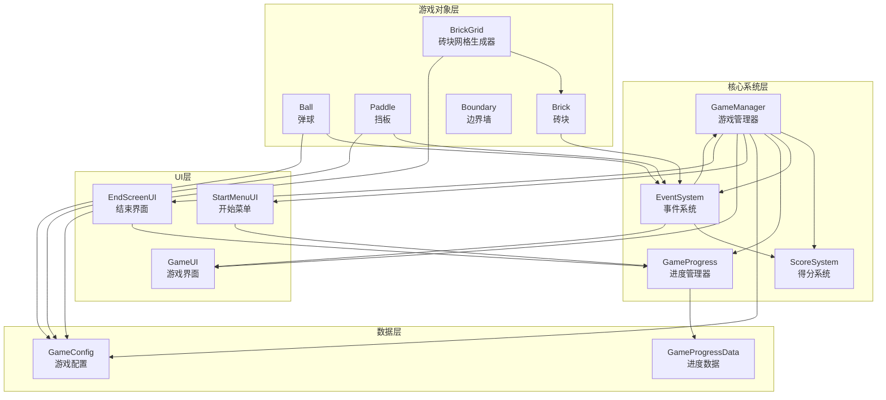
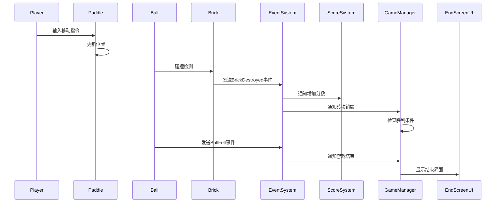

# Unity弹球打砖块游戏 - 技术设计文档

## 概述

本文档描述了基于Unity 2022的弹球打砖块游戏的技术设计。该游戏实现经典打砖块玩法，玩家通过控制挡板反弹弹球击碎砖块获得分数。游戏采用模块化架构设计，确保各系统职责清晰、易于维护和扩展。

### 技术栈

- **游戏引擎**: Unity 2022.3 LTS
- **编程语言**: C#
- **物理引擎**: Unity 2D Physics
- **UI系统**: Unity UI (uGUI)
- **场景管理**: Unity SceneManager

### 设计目标

1. 模块化架构，各系统职责单一
2. 基于事件驱动的松耦合设计
3. 可扩展的关卡和砖块系统
4. 流畅的物理交互体验
5. 清晰的游戏状态管理
6. 多关卡渐进式难度系统
7. 持久化数据存储和进度追踪
8. 跨平台输入支持（键盘+触控）
9. 响应式UI自适应不同屏幕尺寸

## 架构

### 系统架构图



### 架构层次

#### 1. 核心系统层 (Core Systems)

负责游戏的整体控制和状态管理：

- **GameManager**: 单例模式，管理游戏流程、场景切换、游戏状态、关卡管理
- **ScoreSystem**: 管理分数计算、存储和查询
- **EventSystem**: 基于观察者模式的事件分发系统
- **GameProgress**: 持久化数据管理，保存玩家进度和统计信息

#### 2. 数据层 (Data Layer)

配置和持久化数据：

- **GameConfig**: ScriptableObject，存储游戏配置和关卡参数
- **GameProgressData**: 序列化数据类，存储玩家进度信息

#### 3. 游戏对象层 (Game Objects)

实现具体游戏逻辑的组件：

- **Ball**: 弹球物理行为和碰撞检测，支持关卡特定速度
- **Paddle**: 玩家输入处理和移动控制，支持键盘和触控输入，关卡特定尺寸
- **Brick**: 砖块生命值和销毁逻辑
- **BrickGrid**: 砖块网格的程序化生成，支持关卡配置
- **Boundary**: 游戏区域边界墙

#### 4. UI层 (User Interface)

用户界面和交互，支持响应式布局：

- **StartMenuUI**: 开始菜单界面，显示进度统计
- **GameUI**: 游戏中的HUD显示
- **EndScreenUI**: 游戏结束界面，支持下一关按钮

用户界面和交互：

- **StartMenuUI**: 开始菜单界面
- **GameUI**: 游戏中的HUD显示
- **EndScreenUI**: 游戏结束界面

### 数据流



## 组件和接口

### 1. GameManager (游戏管理器)

**职责**: 管理游戏整体流程和状态

**状态枚举**:
```csharp
public enum GameState
{
    StartMenu,    // 开始菜单
    Playing,      // 游戏进行中
    GameOver,     // 游戏结束（失败）
    Victory       // 游戏胜利
}
```

**公共接口**:
```csharp
public class GameManager : MonoBehaviour
{
    // 单例实例
    public static GameManager Instance { get; private set; }
    
    // 当前游戏状态
    public GameState CurrentState { get; private set; }
    
    // 关卡管理
    private int currentLevel = 1;
    public int GetCurrentLevel();
    public bool HasNextLevel();
    public void LoadNextLevel();
    
    // 场景管理
    public void LoadStartMenu();
    public void LoadGameScene();
    public void RestartGame();
    
    // 游戏流程控制
    public void StartGame();
    public void EndGame(bool isVictory);
    
    // 砖块计数
    public void RegisterBrick();
    public void UnregisterBrick();
    public int GetRemainingBricks();
}
```

**事件订阅**:
- `BrickDestroyed`: 减少砖块计数，检查胜利条件
- `BallFell`: 触发游戏结束

### 2. ScoreSystem (得分系统)

**职责**: 管理玩家分数

**公共接口**:
```csharp
public class ScoreSystem : MonoBehaviour
{
    // 单例实例
    public static ScoreSystem Instance { get; private set; }
    
    // 分数管理
    public int CurrentScore { get; private set; }
    public void AddScore(int points);
    public void ResetScore();
    
    // 分数配置
    public int BrickDestroyScore = 10;
}
```

**事件发布**:
- `ScoreChanged(int newScore)`: 分数变化时触发

### 3. EventSystem (事件系统)

**职责**: 解耦组件间通信

**事件定义**:
```csharp
public static class GameEvents
{
    // 游戏流程事件
    public static event Action GameStarted;
    public static event Action<bool> GameEnded; // 参数: isVictory
    
    // 游戏对象事件
    public static event Action BrickDestroyed;
    public static event Action BallFell;
    public static event Action<Vector2> BallPaddleCollision; // 参数: 碰撞位置
    
    // 分数事件
    public static event Action<int> ScoreChanged; // 参数: 新分数
}
```

### 4. GameProgress (进度管理器)

**职责**: 持久化数据管理和玩家进度追踪

**数据模型**:
```csharp
[Serializable]
public class GameProgressData
{
    public int highestLevelUnlocked = 1;  // 最高解锁关卡
    public int highestScore = 0;          // 最高分数
    public int totalGamesPlayed = 0;      // 总游戏次数
    public int totalVictories = 0;        // 总胜利次数
    public int[] levelHighScores = new int[10]; // 每关最高分
}
```

**公共接口**:
```csharp
public class GameProgress : MonoBehaviour
{
    // 单例实例
    public static GameProgress Instance { get; private set; }
    
    // 数据管理
    public void LoadProgress();
    public void SaveProgress();
    
    // 关卡解锁
    public void UnlockLevel(int level);
    public bool IsLevelUnlocked(int level);
    public int GetHighestLevelUnlocked();
    
    // 分数管理
    public void UpdateHighScore(int score);
    public void UpdateLevelHighScore(int level, int score);
    public int GetHighScore();
    public int GetLevelHighScore(int level);
    
    // 游戏统计
    public void RecordGameCompletion(bool isVictory, int finalScore, int level);
    public int GetTotalGamesPlayed();
    public int GetTotalVictories();
    
    // 数据重置
    public void ResetProgress();
    public void DeleteSaveData();
}
```

**存储机制**:
- 使用Unity PlayerPrefs + JSON序列化
- 自动保存在游戏结束时
- 支持跨平台数据持久化

### 5. Ball (弹球)

**职责**: 弹球的物理行为和碰撞处理

**组件依赖**:
- `Rigidbody2D`: 物理刚体
- `CircleCollider2D`: 圆形碰撞体

**公共接口**:
```csharp
public class Ball : MonoBehaviour
{
    // 配置参数
    public float Speed = 5f;
    public float MinAngle = 30f; // 最小反弹角度（度）
    
    // 生命周期
    public void Launch();
    public void ResetPosition();
    
    // 速度控制
    private void NormalizeVelocity();
    private void AdjustAngle(Vector2 normal);
    private void PreventHorizontalTrapping(); // 防止水平来回弹跳
}
```

**关卡适配**:
- 从GameConfig加载当前关卡的球速配置
- 支持每关不同的速度设置

**碰撞处理**:
- 与墙壁碰撞: 物理反弹
- 与挡板碰撞: 根据碰撞位置调整反弹角度，发送事件
- 与砖块碰撞: 物理反弹，触发砖块销毁
- 掉落检测: Y坐标低于阈值时发送`BallFell`事件

### 6. Paddle (挡板)

**职责**: 处理玩家输入并控制挡板移动，支持多平台输入

**组件依赖**:
- `BoxCollider2D`: 矩形碰撞体
- `Rigidbody2D`: 运动学刚体（Kinematic）

**公共接口**:
```csharp
public class Paddle : MonoBehaviour
{
    // 配置参数
    public float MoveSpeed = 10f;
    public float MinX = -8f;
    public float MaxX = 8f;
    
    // 输入处理（支持键盘和触控）
    private void HandleInput();
    private void Move(float direction);
    
    // 边界限制
    private void ClampPosition();
}
```

**输入映射**:
- **键盘输入**:
  - 左移: `A` 键或 `Left Arrow`
  - 右移: `D` 键或 `Right Arrow`
- **触控/鼠标输入**:
  - 点击屏幕左半侧: 向左移动
  - 点击屏幕右半侧: 向右移动
  - 支持触摸和鼠标，适配PC和移动设备

**关卡适配**:
- 从GameConfig加载当前关卡的挡板宽度
- 支持每关不同的挡板尺寸（难度递增）

### 7. Brick (砖块)
    public float MinX = -8f;
    public float MaxX = 8f;
    
    // 输入处理
    private void HandleInput();
    private void Move(float direction);
    
    // 边界限制
    private void ClampPosition();
}
```

**输入映射**:
- 左移: `A` 键或 `Left Arrow`
- 右移: `D` 键或 `Right Arrow`

### 6. Brick (砖块)

**职责**: 砖块的生命值管理和销毁逻辑

**组件依赖**:
- `BoxCollider2D`: 矩形碰撞体
- `SpriteRenderer`: 精灵渲染器

**公共接口**:
```csharp
public class Brick : MonoBehaviour
{
    // 配置参数
    public int Health = 1;
    public int ScoreValue = 10;
    
    // 生命周期
    public void TakeDamage(int damage = 1);
    private void DestroyBrick();
}
```

**碰撞处理**:
- 与弹球碰撞时调用`TakeDamage()`
- 生命值归零时调用`DestroyBrick()`并发送`BrickDestroyed`事件

### 7. BrickGrid (砖块网格生成器)

**职责**: 程序化生成砖块网格

**公共接口**:
```csharp
public class BrickGrid : MonoBehaviour
{
    // 配置参数
    public GameObject BrickPrefab;
    public int Rows = 5;
    public int Columns = 8;
    public float BrickWidth = 1f;
    public float BrickHeight = 0.5f;
    public float Spacing = 0.1f;
    public Vector2 StartPosition = new Vector2(-4f, 3f);
    
    // 生成方法
    public void GenerateGrid();
    private void SpawnBrick(int row, int col);
}
```

### 8. Boundary (边界墙)

**职责**: 定义游戏区域边界

**组件依赖**:
- `BoxCollider2D`: 矩形碰撞体

**配置**:
- 左墙: X = -9, 高度覆盖游戏区域
- 右墙: X = 9, 高度覆盖游戏区域
- 顶墙: Y = 5, 宽度覆盖游戏区域
- 底部边界: Y = -6 (触发线，无碰撞体)

### 9. UI组件

#### StartMenuUI (开始菜单)

```csharp
public class StartMenuUI : MonoBehaviour
{
    public Button StartButton;
    public Text TitleText;
    public Text InstructionsText;
    public Text ProgressText;
    
    private void OnStartButtonClicked();
    private void UpdateProgressDisplay();
}
```

**功能增强**:
- 显示玩家进度统计（最高关卡、最高分、游戏次数、胜利次数）
- 从GameProgress加载并显示数据
- 响应式布局，适配不同屏幕尺寸

#### GameUI (游戏界面)

```csharp
public class GameUI : MonoBehaviour
{
    public Text ScoreText;
    
    public void UpdateScore(int score);
}
```

#### EndScreenUI (结束界面)

```csharp
public class EndScreenUI : MonoBehaviour
{
    public Text MessageText;
    public Text FinalScoreText;
    public Button RestartButton;
    public Button NextLevelButton;
    public Button MainMenuButton;
    
    public void Show(bool isVictory);
    private void OnRestartButtonClicked();
    private void OnNextLevelButtonClicked();
    private void OnMainMenuButtonClicked();
}
```

**功能增强**:
- 根据胜利状态显示不同消息（"Level X Complete!" 或 "Game Over"）
- 显示当前分数和历史最高分
- 根据是否有下一关动态显示/隐藏NextLevelButton
- 响应式布局，适配不同屏幕尺寸

## 数据模型

### 1. 游戏配置数据

```csharp
[CreateAssetMenu(fileName = "GameConfig", menuName = "Breakout/GameConfig")]
public class GameConfig : ScriptableObject
{
    [Header("Ball Settings")]
    public float BallSpeed = 5f;
    public float BallMinAngle = 30f;
    public float BallLaunchAngleRange = 30f;
    
    [Header("Paddle Settings")]
    public float PaddleMoveSpeed = 10f;
    public float PaddleMinX = -11f;
    public float PaddleMaxX = 11f;
    public float PaddleWidth = 2f;
    public float PaddleHeight = 0.3f;
    
    [Header("Brick Settings")]
    public int BrickRows = 5;
    public int BrickColumns = 8;
    public float BrickWidth = 1.2f;
    public float BrickHeight = 0.5f;
    public float BrickSpacing = 0.15f;
    public Vector2 BrickStartPosition = new Vector2(-5.2f, 2.5f);
    
    [Header("Score Settings")]
    public int BrickDestroyScore = 10;
    
    [Header("Boundary Settings")]
    public float LeftBoundary = -12f;
    public float RightBoundary = 12f;
    public float TopBoundary = 7.5f;
    public float BottomBoundary = -7.5f;
    public float BoundaryThickness = 0.5f;
    
    [Header("Camera Settings")]
    public float CameraSize = 8f;
    public Vector3 CameraPosition = new Vector3(0f, 0f, -10f);
    
    [Header("Level Settings")]
    public int TotalLevels = 3;
    
    [Serializable]
    public class LevelConfig
    {
        public int rows = 5;
        public int columns = 8;
        public float ballSpeed = 5f;
        public float paddleWidth = 2f;
    }
    
    public LevelConfig[] levelConfigs = new LevelConfig[]
    {
        new LevelConfig { rows = 5, columns = 8, ballSpeed = 5f, paddleWidth = 2f },    // 第1关
        new LevelConfig { rows = 6, columns = 10, ballSpeed = 6f, paddleWidth = 1.8f }, // 第2关
        new LevelConfig { rows = 7, columns = 12, ballSpeed = 7f, paddleWidth = 1.5f }  // 第3关
    };
}
```

### 2. 场景数据

**场景列表**:
- `StartMenu`: 开始菜单场景
- `GameScene`: 游戏主场景
- `EndScreen`: 结束界面场景（可选，也可用UI面板实现）

**GameScene层次结构**:
```
GameScene
├── GameManager (空对象)
├── ScoreSystem (空对象)
├── GameProgress (空对象)
├── Camera
├── Canvas (UI)
│   ├── ScoreText
│   └── EndScreenPanel
│       ├── MessageText
│       ├── FinalScoreText
│       ├── ButtonContainer
│       │   ├── NextLevelButton
│       │   ├── RestartButton
│       │   └── MainMenuButton
├── Ball
├── Paddle
├── BrickGrid (空对象)
│   └── Bricks (运行时生成)
└── Boundaries
    ├── LeftWall
    ├── RightWall
    └── TopWall
```

### 3. UI响应式设计

**CanvasScaler配置**:
```csharp
scaler.uiScaleMode = CanvasScaler.ScaleMode.ScaleWithScreenSize;
scaler.referenceResolution = new Vector2(1920, 1080);
scaler.screenMatchMode = CanvasScaler.ScreenMatchMode.MatchWidthOrHeight;
scaler.matchWidthOrHeight = 0f; // 宽度优先，适合横屏游戏
```

**响应式布局原则**:
- 使用锚点（Anchor）定义相对位置，而非固定像素
- 使用offsetMin/offsetMax实现真正的自适应
- 所有Text组件启用resizeTextForBestFit
- 设置合理的最小/最大字体大小范围

**EndScreen布局示例**:
- 标题：占屏幕宽度20%-80%，高度70%-85%
- 分数：占屏幕宽度20%-80%，高度55%-68%
- 按钮容器：占屏幕宽度25%-75%，高度15%-50%
- 每个按钮使用相对位置，自动适应容器大小

**适配目标设备**:
- 手机竖屏/横屏
- 平板设备
- PC不同分辨率
- 不同宽高比的屏幕

### 4. 物理层配置

**Layer设置**:
- `Default`: 默认层
- `Ball`: 弹球层
- `Paddle`: 挡板层
- `Brick`: 砖块层
- `Boundary`: 边界层

**碰撞矩阵**:
```
         Ball  Paddle  Brick  Boundary
Ball      ✗      ✓      ✓       ✓
Paddle    ✓      ✗      ✗       ✗
Brick     ✓      ✗      ✗       ✗
Boundary  ✓      ✗      ✗       ✗
```

### 5. 物理材质

**Ball Physics Material**:
- Friction: 0 (无摩擦)
- Bounciness: 1 (完全弹性)

**Paddle Physics Material**:
- Friction: 0
- Bounciness: 1

**Boundary Physics Material**:
- Friction: 0
- Bounciness: 1

## 正确性属性

*属性是一个特征或行为，应该在系统的所有有效执行中保持为真——本质上是关于系统应该做什么的正式陈述。属性作为人类可读规范和机器可验证正确性保证之间的桥梁。*


### 属性 1: 场景切换正确性

*对于任意*场景切换操作（开始游戏、重新开始、返回主菜单），系统应该正确加载目标场景并初始化相应的游戏状态。

**验证: 需求 1.2, 1.5, 6.3, 7.4, 7.6**

### 属性 2: 球掉落触发游戏结束

*对于任意*游戏状态，当弹球的Y坐标低于底部边界阈值时，系统应该触发游戏结束并显示结束界面。

**验证: 需求 1.3, 3.6**

### 属性 3: 所有砖块被销毁触发胜利

*对于任意*砖块配置，当剩余砖块数量降为0时，系统应该触发游戏胜利并显示结束界面。

**验证: 需求 1.4, 4.5**

### 属性 4: 挡板左移响应

*对于任意*挡板位置（在右边界内），当玩家按下左方向键或A键时，挡板的X坐标应该减小（向左移动）。

**验证: 需求 2.2**

### 属性 5: 挡板右移响应

*对于任意*挡板位置（在左边界内），当玩家按下右方向键或D键时，挡板的X坐标应该增大（向右移动）。

**验证: 需求 2.3**

### 属性 6: 挡板边界约束不变量

*对于任意*移动输入和挡板位置，挡板的X坐标应该始终满足 MinX ≤ X ≤ MaxX 的边界约束。

**验证: 需求 2.4**

### 属性 7: 挡板反弹弹球

*对于任意*弹球速度和碰撞角度，当弹球与挡板碰撞时，弹球的Y方向速度应该反转为向上（正值），实现反弹效果。

**验证: 需求 2.5**

### 属性 8: 弹球恒定速度不变量

*对于任意*时刻和弹球状态，弹球的速度大小（magnitude）应该等于配置的恒定速度值，确保游戏节奏稳定。

**验证: 需求 3.2**

### 属性 9: 墙壁反弹物理规则

*对于任意*弹球速度和墙壁碰撞，碰撞后的反射角应该等于入射角（相对于墙壁法线），遵循物理反弹规则。

**验证: 需求 3.3, 8.4**

### 属性 10: 挡板碰撞改变反弹角度

*对于任意*挡板碰撞位置，碰撞点距离挡板中心越远，反弹后的水平速度分量应该越大，实现角度控制。

**验证: 需求 3.4**

### 属性 11: 砖块碰撞销毁和反弹

*对于任意*砖块和弹球碰撞，弹球应该反弹，且砖块应该被标记为销毁（生命值减少或直接销毁）。

**验证: 需求 3.5, 4.2**

### 属性 12: 砖块销毁增加分数

*对于任意*砖块销毁事件，玩家的当前分数应该增加该砖块的分数值（默认10分）。

**验证: 需求 4.3, 5.2**

### 属性 13: 游戏中UI显示当前分数

*对于任意*分数变化，游戏界面的分数文本应该实时更新并显示当前分数值。

**验证: 需求 5.3**

### 属性 14: 结束界面显示最终分数

*对于任意*游戏结束状态（失败或胜利），结束界面应该显示游戏结束时的最终分数。

**验证: 需求 5.4, 7.2**

### 属性 15: 返回主菜单场景切换

*对于任意*游戏状态，当玩家点击返回主菜单按钮时，系统应该加载开始菜单场景并重置游戏状态。

**验证: 需求 7.6**

### 属性 16: 关卡进度持久化

*对于任意*游戏会话，当玩家完成关卡后，系统应该保存进度数据（最高解锁关卡、分数、统计信息），并在下次启动时正确加载。

**验证: 多关卡系统需求**

### 属性 17: 关卡难度递增

*对于任意*关卡N（N > 1），关卡N的难度参数（砖块数量、球速、挡板宽度）应该比关卡N-1更具挑战性。

**验证: 多关卡系统需求**

### 属性 18: 触控输入响应

*对于任意*触控或鼠标输入，当点击屏幕左半侧时挡板应该向左移动，点击右半侧时应该向右移动。

**验证: 移动设备支持需求**

### 属性 19: UI自适应不变量

*对于任意*屏幕分辨率和宽高比，所有UI元素应该保持在可见区域内，且文字大小应该在可读范围内。

**验证: UI响应式设计需求**

### 属性 20: 下一关按钮可见性

*对于任意*游戏胜利状态，当且仅当存在下一关时，结束界面应该显示"下一关"按钮。

**验证: 多关卡系统需求**

**验证: 需求 7.6**

## 错误处理

### 1. 物理异常处理

**问题**: 弹球速度异常（过快、过慢或为零）

**处理策略**:
- 在`Ball.Update()`中检测速度大小
- 如果速度偏离配置值超过阈值，重新归一化速度
- 记录警告日志

```csharp
private void NormalizeVelocity()
{
    float currentSpeed = rb.velocity.magnitude;
    if (Mathf.Abs(currentSpeed - Speed) > 0.1f)
    {
        Debug.LogWarning($"Ball speed deviation detected: {currentSpeed}, normalizing to {Speed}");
        rb.velocity = rb.velocity.normalized * Speed;
    }
}
```

**问题**: 弹球卡在物体之间

**处理策略**:
- 使用连续碰撞检测（Continuous Collision Detection）
- 设置物理材质摩擦力为0
- 如果检测到速度长时间过低，强制重新发射

### 2. 场景加载错误

**问题**: 场景加载失败

**处理策略**:
- 使用`SceneManager.LoadSceneAsync()`并检查返回值
- 捕获异常并显示错误提示
- 提供回退机制（返回主菜单）

```csharp
public void LoadGameScene()
{
    try
    {
        AsyncOperation asyncLoad = SceneManager.LoadSceneAsync("GameScene");
        if (asyncLoad == null)
        {
            Debug.LogError("Failed to load GameScene");
            LoadStartMenu(); // 回退
        }
    }
    catch (Exception e)
    {
        Debug.LogError($"Scene loading error: {e.Message}");
        LoadStartMenu();
    }
}
```

### 3. 砖块生成错误

**问题**: 砖块预制体缺失或配置错误

**处理策略**:
- 在`BrickGrid.Start()`中验证预制体引用
- 如果预制体为空，记录错误并跳过生成
- 提供默认配置值

```csharp
public void GenerateGrid()
{
    if (BrickPrefab == null)
    {
        Debug.LogError("BrickPrefab is not assigned!");
        return;
    }
    
    if (Rows <= 0 || Columns <= 0)
    {
        Debug.LogWarning("Invalid grid dimensions, using defaults");
        Rows = 5;
        Columns = 8;
    }
    
    // 生成逻辑...
}
```

### 4. 事件系统错误

**问题**: 事件订阅者抛出异常

**处理策略**:
- 在事件触发时使用try-catch包装
- 记录异常但不中断其他订阅者
- 提供事件调试模式

```csharp
public static void TriggerBrickDestroyed()
{
    if (BrickDestroyed != null)
    {
        foreach (var handler in BrickDestroyed.GetInvocationList())
        {
            try
            {
                handler.DynamicInvoke();
            }
            catch (Exception e)
            {
                Debug.LogError($"Event handler error: {e.Message}");
            }
        }
    }
}
```

### 5. UI更新错误

**问题**: UI组件引用丢失

**处理策略**:
- 在UI更新前检查组件引用
- 使用空值检查避免空引用异常
- 提供默认UI文本

```csharp
public void UpdateScore(int score)
{
    if (ScoreText != null)
    {
        ScoreText.text = $"Score: {score}";
    }
    else
    {
        Debug.LogWarning("ScoreText reference is missing");
    }
}
```

### 6. 边界检测错误

**问题**: 弹球未正确检测到底部边界

**处理策略**:
- 使用双重检测：物理触发器 + 位置检查
- 在`Ball.Update()`中持续检查Y坐标
- 设置安全边界阈值

```csharp
private void Update()
{
    // 安全检查：防止物理检测失败
    if (transform.position.y < bottomBoundary - 1f)
    {
        Debug.LogWarning("Ball fell below boundary without trigger");
        OnBallFell();
    }
}
```

## 测试策略

### 测试方法论

本项目采用**双重测试方法**：

1. **单元测试**: 验证具体示例、边缘情况和错误条件
2. **属性测试**: 验证跨所有输入的通用属性

两者互补，共同确保全面覆盖：
- 单元测试捕获具体的错误和边缘情况
- 属性测试通过随机化验证通用正确性

### 单元测试策略

**测试框架**: Unity Test Framework (NUnit)

**测试范围**:

1. **初始化测试** (示例测试)
   - 游戏启动显示开始菜单 (需求 1.1)
   - 游戏场景开始时球从挡板上方发射 (需求 3.1)
   - 游戏场景开始时分数初始化为0 (需求 5.1)
   - 游戏场景加载时生成砖块网格 (需求 4.1)

2. **UI元素存在性测试** (示例测试)
   - 开始菜单显示游戏标题 (需求 6.1)
   - 开始菜单显示开始按钮 (需求 6.2)
   - 开始菜单显示操作说明 (需求 6.4)
   - 结束界面显示结束提示 (需求 7.1)
   - 结束界面显示重新开始按钮 (需求 7.3)
   - 结束界面显示返回主菜单按钮 (需求 7.5)
   - 游戏场景包含左侧边界墙 (需求 8.1)
   - 游戏场景包含右侧边界墙 (需求 8.2)
   - 游戏场景包含顶部边界墙 (需求 8.3)
   - 游戏场景定义底部边界 (需求 8.5)

3. **边缘情况测试**
   - 挡板在左边界时继续左移
   - 挡板在右边界时继续右移
   - 弹球以极小角度碰撞挡板
   - 弹球以极大角度碰撞墙壁
   - 最后一个砖块被销毁
   - 分数达到最大值

4. **错误条件测试**
   - 砖块预制体缺失
   - 场景加载失败
   - UI组件引用丢失
   - 物理速度异常

**示例单元测试**:

```csharp
[Test]
public void GameStartsWithStartMenu()
{
    // 需求 1.1: 游戏启动显示开始菜单
    SceneManager.LoadScene("StartMenu");
    Assert.AreEqual("StartMenu", SceneManager.GetActiveScene().name);
}

[Test]
public void ScoreInitializesToZero()
{
    // 需求 5.1: 分数初始化为0
    ScoreSystem.Instance.ResetScore();
    Assert.AreEqual(0, ScoreSystem.Instance.CurrentScore);
}

[Test]
public void StartMenuHasStartButton()
{
    // 需求 6.2: 开始菜单显示开始按钮
    SceneManager.LoadScene("StartMenu");
    var startButton = GameObject.Find("StartButton");
    Assert.IsNotNull(startButton);
    Assert.IsNotNull(startButton.GetComponent<Button>());
}

[Test]
public void PaddleStaysWithinLeftBoundary()
{
    // 边缘情况: 挡板在左边界时继续左移
    var paddle = new GameObject().AddComponent<Paddle>();
    paddle.MinX = -8f;
    paddle.transform.position = new Vector3(-8f, 0, 0);
    
    // 模拟左移输入
    paddle.Move(-1f);
    
    Assert.GreaterOrEqual(paddle.transform.position.x, paddle.MinX);
}
```

### 属性测试策略

**测试框架**: 使用C#属性测试库（推荐 **FsCheck** 或 **Hedgehog**）

**配置要求**:
- 每个属性测试最少运行 **100次迭代**
- 每个测试必须引用设计文档中的属性编号
- 标签格式: `// Feature: unity-breakout-game, Property {N}: {property_text}`

**属性测试实现**:

```csharp
using FsCheck;
using NUnit.Framework;

[Test]
public void Property_PaddleBoundaryConstraint()
{
    // Feature: unity-breakout-game, Property 6: 挡板边界约束不变量
    // 对于任意移动输入和挡板位置，挡板X坐标应该始终在[MinX, MaxX]范围内
    
    Prop.ForAll<float, float>((initialX, moveInput) =>
    {
        var paddle = CreateTestPaddle();
        paddle.MinX = -8f;
        paddle.MaxX = 8f;
        paddle.transform.position = new Vector3(
            Mathf.Clamp(initialX, paddle.MinX, paddle.MaxX), 0, 0
        );
        
        paddle.Move(moveInput);
        
        return paddle.transform.position.x >= paddle.MinX &&
               paddle.transform.position.x <= paddle.MaxX;
    }).QuickCheckThrowOnFailure();
}

[Test]
public void Property_BallConstantSpeed()
{
    // Feature: unity-breakout-game, Property 8: 弹球恒定速度不变量
    // 对于任意时刻，弹球速度大小应该等于配置的恒定速度值
    
    Prop.ForAll<float, float>((vx, vy) =>
    {
        var ball = CreateTestBall();
        ball.Speed = 5f;
        
        // 设置任意方向的速度
        var velocity = new Vector2(vx, vy).normalized * ball.Speed;
        ball.GetComponent<Rigidbody2D>().velocity = velocity;
        
        ball.NormalizeVelocity(); // 调用速度归一化
        
        float actualSpeed = ball.GetComponent<Rigidbody2D>().velocity.magnitude;
        return Mathf.Abs(actualSpeed - ball.Speed) < 0.01f;
    }).QuickCheckThrowOnFailure();
}

[Test]
public void Property_BrickDestroyIncrementsScore()
{
    // Feature: unity-breakout-game, Property 12: 砖块销毁增加分数
    // 对于任意砖块销毁事件，分数应该增加砖块的分数值
    
    Prop.ForAll<int>((initialScore) =>
    {
        var scoreSystem = ScoreSystem.Instance;
        scoreSystem.CurrentScore = Math.Max(0, initialScore);
        int scoreBefore = scoreSystem.CurrentScore;
        
        var brick = CreateTestBrick();
        brick.ScoreValue = 10;
        brick.DestroyBrick();
        
        return scoreSystem.CurrentScore == scoreBefore + brick.ScoreValue;
    }).QuickCheckThrowOnFailure();
}

[Test]
public void Property_WallReflectionAngle()
{
    // Feature: unity-breakout-game, Property 9: 墙壁反弹物理规则
    // 对于任意弹球速度和墙壁碰撞，反射角应该等于入射角
    
    Prop.ForAll<float, float>((vx, vy) =>
    {
        var ball = CreateTestBall();
        var velocity = new Vector2(vx, vy);
        if (velocity.magnitude < 0.1f) return true; // 跳过零速度
        
        ball.GetComponent<Rigidbody2D>().velocity = velocity;
        
        // 模拟与垂直墙壁碰撞（法线为(1,0)）
        Vector2 wallNormal = Vector2.right;
        Vector2 reflected = Vector2.Reflect(velocity, wallNormal);
        
        // 验证入射角等于反射角
        float incidentAngle = Vector2.Angle(-velocity, wallNormal);
        float reflectedAngle = Vector2.Angle(reflected, wallNormal);
        
        return Mathf.Abs(incidentAngle - reflectedAngle) < 1f;
    }).QuickCheckThrowOnFailure();
}

[Test]
public void Property_AllBricksDestroyedTriggersVictory()
{
    // Feature: unity-breakout-game, Property 3: 所有砖块被销毁触发胜利
    // 对于任意砖块配置，当剩余砖块数量为0时，应该触发胜利
    
    Prop.ForAll<int>((brickCount) =>
    {
        int count = Math.Max(1, Math.Min(brickCount, 100)); // 限制范围
        var gameManager = GameManager.Instance;
        
        // 创建砖块
        for (int i = 0; i < count; i++)
        {
            gameManager.RegisterBrick();
        }
        
        // 销毁所有砖块
        bool victoryTriggered = false;
        GameEvents.GameEnded += (isVictory) => { victoryTriggered = isVictory; };
        
        for (int i = 0; i < count; i++)
        {
            gameManager.UnregisterBrick();
        }
        
        return victoryTriggered && gameManager.GetRemainingBricks() == 0;
    }).QuickCheckThrowOnFailure();
}
```

### 测试覆盖率目标

- **代码覆盖率**: ≥ 80%
- **需求覆盖率**: 100% (所有验收标准)
- **属性覆盖率**: 100% (所有正确性属性)

### 持续集成

- 每次提交自动运行所有测试
- 单元测试失败阻止合并
- 属性测试失败触发警报
- 生成测试覆盖率报告

### 测试数据管理

- 使用ScriptableObject存储测试配置
- 为属性测试提供自定义生成器
- 记录失败的随机种子以便重现

```csharp
// 自定义生成器示例
public static Arbitrary<Paddle> PaddleGenerator()
{
    return Arb.From(
        Gen.Choose(-8, 8).Select(x => 
        {
            var paddle = CreateTestPaddle();
            paddle.transform.position = new Vector3(x, 0, 0);
            return paddle;
        })
    );
}
```

## 总结

本设计文档定义了Unity弹球打砖块游戏的完整技术架构，包括：

1. **模块化架构**: 清晰的层次划分和职责分离，包含核心系统层、数据层、游戏对象层和UI层
2. **事件驱动设计**: 松耦合的组件通信机制
3. **完整的组件接口**: 详细的API定义和数据模型
4. **多关卡系统**: 支持渐进式难度递增，包含关卡配置和进度管理
5. **持久化数据存储**: 使用PlayerPrefs + JSON实现跨平台数据保存
6. **跨平台输入支持**: 同时支持键盘和触控输入，适配PC和移动设备
7. **响应式UI设计**: 使用锚点和自适应文字，支持不同屏幕尺寸和宽高比
8. **正确性属性**: 20个可验证的系统属性，覆盖核心功能和新增特性
9. **全面的错误处理**: 覆盖物理、场景、UI、数据持久化等各方面
10. **双重测试策略**: 单元测试和属性测试相结合

该设计确保了游戏的可维护性、可扩展性、跨平台兼容性和正确性，为后续开发和迭代提供了清晰的技术蓝图。
